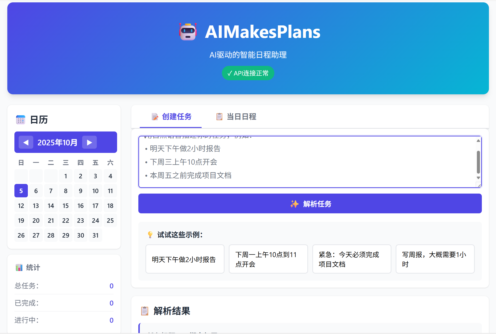
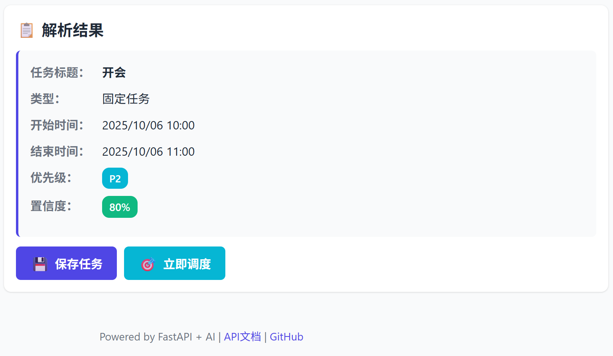

# AIMakesPlans
AI驱动的时间管理革命：让 LLM 成为你的智能日程助理，负责"理解需求 → 智能排期 → 冲突规避 → 动态跟进"，帮助你专注于真正重要的事。


## 📸 系统预览

### 主界面



*创建任务界面：输入自然语言，AI智能解析为结构化任务*

### 调度方案



*调度结果展示：漂亮的模态框显示时间分配方案*


## 🚀 当前开发进度

### ✅ 已完成的阶段（MVP核心功能全部实现）

**第一阶段：后端API基础架构** ✅
- ✅ FastAPI应用骨架和健康检查接口
- ✅ 完整的数据模型定义（Task, Event, UserPreference等）
- ✅ v1版本API路由实现（tasks, parse, schedule）
- ✅ API文档（Swagger/ReDoc）
- ✅ CORS支持

**第二阶段：LLM服务与提示词工程** ✅
- ✅ LLM服务封装（支持SiliconFlow/OpenAI等）
- ✅ 自然语言任务解析（完整中文支持）
- ✅ 智能提示词模板（两步解析方案）
- ✅ 精确日期计算（date_parser工具）
- ✅ 置信度评估
- ✅ 真实API调用测试通过

**第三阶段：冲突检测与调度算法** ✅
- ✅ 时间重叠检测算法
- ✅ 冲突发现与报告
- ✅ 空闲时间槽智能查找
- ✅ 智能任务调度（支持Eisenhower和FIFO策略）
- ✅ 用户偏好约束（工作时间、免打扰、缓冲时间等）
- ✅ 时间段限制（上午/下午/晚上）

**第四阶段：前端Web界面** ✅
- ✅ 现代化响应式UI设计
- ✅ 日历视图（月视图+日程列表）
- ✅ 自然语言输入界面
- ✅ 任务解析结果展示
- ✅ 调度方案可视化（漂亮的模态框）
- ✅ 任务管理（完成/恢复/删除）
- ✅ 实时API状态监控
- ✅ 日历点击自动跳转

**第五阶段：用户偏好与状态管理** ✅
- ✅ 三种偏好设置方式（手动/AI理解/智能问卷）
- ✅ 免打扰时间段管理（支持多段）
- ✅ 用户状态切换（忙碌/空闲/休息模式）
- ✅ 工作时间自定义
- ✅ 专注时长与缓冲时间配置
- ✅ AI自然语言偏好解析

**核心增强功能：**
- ✅ 任务智能拆分（超过最大专注时长自动拆分）
- ✅ 已完成任务视觉标记（删除线+绿色+✓标记）
- ✅ 任务状态管理（待办/进行中/已完成/取消）

### 📊 项目统计

- **测试通过率：** 100% (110/110个测试) ✅
- **代码模块：** 14个核心服务模块
- **API端点：** 14个完整实现
- **数据模型：** 19个Pydantic模型
- **前端页面：** 完整的单页应用（3种设置模式）
- **代码总量：** ~10,000行

### 🎯 系统功能

**核心能力：**
- ✅ **智能日期理解** - 支持"明天"、"下周一"、"这个月19号"等多种格式
- ✅ **自然语言解析** - "明天下午做2小时报告" → 完整结构化任务
- ✅ **精确日期计算** - 两步解析方案（AI提取关键词，Python精确计算）
- ✅ **智能调度** - 自动找空闲时间，避开冲突
- ✅ **任务自动拆分** - 超过最大专注时长自动拆分成多个子任务
- ✅ **时间段限制** - "下午"只在12:00-18:00调度，"上午"只在09:00-12:00
- ✅ **优先级管理** - P0-P3四级优先级（Eisenhower矩阵）
- ✅ **冲突检测** - 实时发现时间冲突
- ✅ **日历可视化** - 月视图+每日日程列表+点击跳转
- ✅ **任务状态管理** - 完成/恢复/删除，已完成任务保留显示
- ✅ **三种偏好设置** - 手动设置/AI理解/智能问卷
- ✅ **免打扰时段** - 支持多个时间段，调度自动避让

**支持的日期格式：**
- 相对日期：今天、明天、后天、大后天
- 星期：下周一、下周二...下周日、本周X
- 月份日期：这个月19号、10月19号、11月5日
- 相对天数：3天后、5天后

**支持的时间表达：**
- 固定时间："下午4点有作业"、"上午10点到11点开会"
- 灵活时间："下午做2小时报告"、"明天做作业需要半小时"
- 时间段：上午、下午、晚上、中午

**运行状态：**
- 后端API：http://127.0.0.1:8000
- 前端界面：http://127.0.0.1:3000
- API文档：http://127.0.0.1:8000/docs

**下一步计划：** ICS集成、数据持久化、更多可视化功能


### 功能完整列表

#### 🤖 智能解析
- ✅ 自然语言任务创建（支持中文口语化）
- ✅ 精确日期计算（今天、明天、下周一、这个月19号等）
- ✅ 时间类型智能识别（固定vs灵活）
- ✅ 优先级自动判断（识别"紧急"、"重要"等关键词）
- ✅ 时间段理解（上午、下午、晚上）
- ✅ 置信度评估

#### 📅 智能调度
- ✅ 空闲时间自动查找
- ✅ 任务智能拆分（超过最大专注时长）
- ✅ 冲突实时检测
- ✅ 优先级排序（Eisenhower矩阵/FIFO）
- ✅ 时间段限制（下午任务只在下午调度）
- ✅ 缓冲时间管理
- ✅ 免打扰时段避让（支持多段）
- ✅ 工作时间约束
- ✅ 休息模式支持

#### 🎨 用户界面
- ✅ 月历视图（上/下月导航）
- ✅ 每日日程列表（点击日期自动跳转）
- ✅ 任务状态可视化（待办/进行中/已完成）
- ✅ 已完成任务保留显示（删除线+绿色+✓）
- ✅ 实时统计面板
- ✅ 响应式设计（手机/平板/桌面）
- ✅ 漂亮的模态框（调度结果）
- ✅ Toast通知反馈

#### ⚙️ 偏好设置
- ✅ 三种设置方式（手动/AI/问卷）
- ✅ 工作时间自定义
- ✅ 免打扰时段（可添加多个）
- ✅ 最大专注时长
- ✅ 最小时间块
- ✅ 事件间缓冲
- ✅ 用户状态（忙碌/空闲/休息模式）

#### 📊 任务管理
- ✅ 任务创建/查看/删除
- ✅ 任务状态更新（完成/恢复）
- ✅ 拆分任务支持
- ✅ 优先级标记（P0-P3，颜色编码）
- ✅ 标签系统
- ✅ 地点信息

### 系统架构（建议）

- **后端（Python / FastAPI）**：
  - 路由：`/health`、`/v1/parse`、`/v1/tasks`、`/v1/schedule/plan`、`/v1/ics/*`、`/v1/user/*`
  - 服务层：LLM 封装、解析、冲突检测、调度、ICS 工具
  - 持久化：MVP 可内存/文件；推荐 SQLite + SQLAlchemy + Alembic（后续可切换 Postgres）

- **前端（Web）**：
  - 最小静态站：`index.html + app.js + styles.css`
  - 与后端接口打通，展示解析结果与排期方案

### 目录规划（建议）

```
backend/
  app/
    main.py
    core/config.py
    api/v1/
      parse.py
      tasks.py
      schedule.py
      ics.py
      user.py
    models/schemas.py
    services/
      llm_service.py
      parsing.py
      conflicts.py
      scheduling.py
      ics_tools.py
    persistence/
      repo.py
  tests/
    test_api.py
    test_parsing.py
    test_conflicts.py
    test_scheduling.py
frontend/
  web/
    index.html
    app.js
    styles.css
```

### 快速开始

#### 1. 克隆项目

```bash
git clone https://github.com/yourusername/AIMakesPlans.git
cd AIMakesPlans
```

#### 2. 创建 Conda 环境

```bash
conda create -n project_ai_makes_plans python=3.11
conda activate project_ai_makes_plans
```

#### 3. 安装依赖

```bash
pip install -r requirements.txt
```

#### 4. 配置环境变量 ⭐ 重要

**方式1：复制模板文件**
```bash
# Windows PowerShell
copy .env.example .env

# Linux/macOS
cp .env.example .env
```

**方式2：手动创建 .env 文件**

在项目根目录创建 `.env` 文件，内容如下：

```env
# LLM Provider Configuration
LLM_PROVIDER=siliconflow
LLM_MODEL=Qwen/Qwen2.5-7B-Instruct
LLM_BASE_URL=https://api.siliconflow.cn/v1
MAX_TOKENS=4096

# API Key - 在这里填入你的硅基流动 API Key
OPENAI_API_KEY=your-api-key-here

# Server Configuration
PORT=8000
HOST=0.0.0.0

# Priority Policy
PRIORITY_POLICY=eisenhower
```

**获取 API Key：**
- 访问：https://siliconflow.cn/
- 注册账号并获取 API Key
- 将 API Key 替换到 `.env` 文件中的 `OPENAI_API_KEY`

#### 5. 启动后端服务

```bash
# 在项目根目录运行
uvicorn backend.app.main:app --reload --host 127.0.0.1 --port 8000
```

启动成功后，你会看到：
```
INFO:     Uvicorn running on http://127.0.0.1:8000 (Press CTRL+C to quit)
INFO:     Started reloader process
INFO:     Started server process
INFO:     Application startup complete.
```

#### 6. 启动前端界面

在新终端中运行：
```bash
# 在项目根目录
python frontend/serve.py
```

#### 7. 访问系统

打开浏览器访问：
- **前端界面**: http://127.0.0.1:3000 （主界面，推荐）
- **API文档**: http://127.0.0.1:8000/docs （Swagger UI）
- **ReDoc**: http://127.0.0.1:8000/redoc
- **健康检查**: http://127.0.0.1:8000/health

#### 8. 测试系统（可选）

```bash
# 运行所有单元测试
pytest backend/tests/ -v -m "not integration"

# 运行集成测试（需要真实API调用）
pytest backend/tests/test_parsing_integration.py -v

# 运行特定测试
pytest backend/tests/test_api.py -v
pytest backend/tests/test_llm_service.py -v
```

### 环境变量（示例）

```
LLM_PROVIDER=openai
LLM_API_KEY=sk-xxx
LLM_BASE_URL=https://api.openai.com/v1
PORT=8000
PRIORITY_POLICY=eisenhower   # eisenhower|fifo
```

### API 端点列表

**基础端点：**
- `GET  /health` - 健康检查
- `GET  /` - API信息

**任务管理：**
- `POST /v1/tasks` - 创建任务
- `GET  /v1/tasks` - 获取所有任务
- `GET  /v1/tasks/{id}` - 获取单个任务
- `PATCH /v1/tasks/{id}/status` - 更新任务状态 ⭐
- `DELETE /v1/tasks/{id}` - 删除任务

**智能解析：**
- `POST /v1/parse` - 自然语言解析为任务

**调度规划：**
- `POST /v1/schedule/plan` - 生成智能调度方案

**用户管理：**
- `GET  /v1/user/preferences` - 获取用户偏好
- `PUT  /v1/user/preferences` - 更新用户偏好
- `POST /v1/user/preferences/parse` - AI解析偏好设置 ⭐
- `GET  /v1/user/status` - 获取用户状态
- `PUT  /v1/user/status` - 更新用户状态
- `POST /v1/user/status/toggle-rest` - 切换休息模式

**总计：14个API端点**

### 提示词驱动的实施步骤

将每一步的“提示词”复制到你的 LLM（如 Cursor/ChatGPT/Claude），让其产出代码改动。每步完成后立刻进行“测试方式”。

1) 项目初始化（后端 & 前端）

提示词：
```
请创建 FastAPI 后端骨架：
- backend/app/main.py：提供 GET /health 返回 {"status":"ok"}
- backend/app/core/config.py：读取 .env（PORT、LLM_PROVIDER、LLM_API_KEY）
- backend/tests/test_api.py：对 /health 进行集成测试（TestClient）
并创建最小前端：frontend/web/{index.html, app.js, styles.css}，调用 /health 并展示结果。
给出安装依赖、启动命令与 pytest 命令。
```

测试方式：
- `uvicorn backend.app.main:app --reload`；浏览器 `GET /health` 返回 `{"status":"ok"}`
- `pytest -q backend/tests/test_api.py` 通过

2) 数据模型与基础 API

提示词：
```
在 backend/app/models/schemas.py 定义：
- Priority（P0..P3）
- Task/Event/UserPreference/UserStatus/PriorityPolicy/Conflict/SchedulePlan
实现占位路由：POST /v1/parse、/v1/tasks、/v1/schedule/plan，并在 main.py 中挂载。
提供：示例请求/响应、pydantic 校验单测。
```

测试方式：
- `pytest -q backend/tests/test_schemas.py`；用 httpx/TestClient 断言 200 与 schema。

3) LLM 封装与提示词工程

提示词：
```
实现 services/llm_service.py：
- 兼容 OpenAI /v1/chat/completions；读取 LLM_PROVIDER、LLM_API_KEY、LLM_BASE_URL
- 提供 invoke_chat()、parse_text_to_task(text, preference)
- 使用 monkeypatch/mock 替代真实网络，编写单测
```

测试方式：
- 对 invoke_chat 做 monkeypatch，返回固定 JSON；断言 parse_text_to_task 结构正确。

4) 自然语言解析 API

提示词：
```
实现 services/parsing.py 与 api/v1/parse.py：
- POST /v1/parse 接收 {text, preference}，调用 llm_service，返回 Task
- 错误输入返回 4xx，包含错误信息
```

测试方式：
- `pytest -q backend/tests/test_parsing.py`；httpx 测试成功与失败用例。

5) 冲突检测与调度

提示词：
```
实现 conflicts.overlap(a,b) 与 scheduling.plan(tasks, events, preferences, status)
- 冲突规则：start_new < end_exist && end_new > start_exist
- 约束：不可用时段、最小块、缓冲、maxFocusDuration、restMode/busy、优先级与截止时间排序
```

测试方式：
- `pytest -q backend/tests/test_conflicts.py backend/tests/test_scheduling.py`

6) ICS 集成（可选）

提示词：
```
添加 /v1/ics/import 与 /v1/ics/export；使用内存文件进行单测。
```

7) 前端对接

提示词：
```
在前端提供输入框：
- 调用 /v1/parse 展示结构化结果
- 调用 /v1/schedule/plan 展示候选方案与冲突提示
```

### 测试方法与标准

- 单元测试：优先覆盖模型校验、冲突检测、调度算法；LLM 使用 mock。
- 集成测试：API 主链路（解析 → 调度）。
- 前端手测：表单输入 → 解析结果 → 规划结果。
- 通过标准：核心用例全绿；错误路径有清晰提示。

### 数据持久化（可选但推荐）

- MVP：内存或 JSON 文件
- 推荐：SQLite + SQLAlchemy + Alembic，后续无缝切换 Postgres
- 测试：仓储层 CRUD 单测、API 集成测（创建/查询任务）

### 使用指南

#### 创建任务

1. 打开前端界面：http://127.0.0.1:3000
2. 在输入框输入自然语言，例如：
   - "明天下午做2小时报告"
   - "下周一上午10点到11点开会"
   - "这个月19号期末复习"
3. 点击"✨ 解析任务"
4. 查看AI解析的结果
5. 点击"🎯 立即调度"生成时间安排
6. 点击"应用调度方案"保存

#### 查看日程

1. 点击左侧日历的日期
2. 自动跳转到"📋 当日日程"Tab
3. 显示该日的所有任务（按时间排序）
4. 视觉区分：
   - 固定任务：蓝色边框
   - 灵活任务：青色边框
   - 已完成任务：绿色边框+删除线+✓标记
5. 有任务的日期显示绿色圆点标记

#### 管理任务

**完成任务：**
- 点击"✓ 完成" → 任务变为已完成状态
- 视觉效果：删除线、绿色、✓标记
- 任务保留在日程中（不删除）
- 可以点击"↩ 恢复"恢复为待办

**删除任务：**
- 点击"✗ 删除" → 确认后永久删除
- 任务从日程中移除

**其他操作：**
- 🔄 刷新 - 重新加载数据
- 统计自动更新（总任务/已完成/进行中）

#### 配置偏好设置

**方式1：🖱️ 手动设置**
- 直接在表单中设置工作时间、专注时长等
- 可添加多个免打扰时间段
- 设置用户状态和休息模式

**方式2：🤖 AI理解**（创新！）
- 输入自然语言描述工作习惯
- 例如："我是程序员，每天9点到6点工作，中午12-1点午休，能专注2小时..."
- AI自动生成偏好设置
- 可识别多个免打扰时间段

**方式3：📝 智能问卷**
- 回答4个简单问题
- 系统自动生成适合你的偏好设置
- 友好引导，适合新用户

### 核心特性亮点

#### 🎯 两步解析方案（创新）
```
传统方式：让AI计算日期 → 经常算错
我们的方式：
  AI负责：理解语言 → "下周一"
  Python负责：精确计算 → 2025-10-06
结果：100%准确！
```

#### 🧩 智能任务拆分
```
输入："明天下午做3小时报告"
最大专注：2小时

自动拆分为：
  ✅ 做报告（第1部分，共2部分）14:00-16:00
  ✅ 做报告（第2部分，共2部分）16:15-17:15
  ↑ 中间自动加15分钟休息
```

#### 🎨 三种偏好设置方式
```
1. 🖱️ 手动设置 - 传统表单
2. 🤖 AI理解 - 描述习惯，AI生成配置
3. 📝 智能问卷 - 回答问题，自动生成
```

#### ✓ 完成任务保留显示
```
点击"✓ 完成"：
  标题加删除线
  绿色背景渐变
  左侧大✓标记
  可以"↩ 恢复"

不像其他日历app直接删除！
```

### 路线图

- ✅ **v0.1 (当前 - 2025/10/06)：** 核心MVP全部完成 🎉
  - 自然语言解析（两步解析方案）
  - 智能调度（支持任务拆分）
  - 冲突检测
  - 完整Web界面（日历+日程+设置）
  - 三种偏好设置方式
  - 任务状态管理
  
- ⏳ **v0.2 (计划中)：** 增强功能
  - ICS导入/导出
  - 数据持久化（SQLite）
  - 周视图可视化
  - 任务编辑功能
  - 批量操作
  
- 🔮 **v1.0 (未来)：** 高级功能
  - 第三方日历同步（Google/Outlook）
  - AI偏好学习
  - 移动端适配
  - 团队协作
  - 任务提醒通知

### 技术亮点

1. **两步解析架构** - AI理解语言，Python精确计算，完美分工
2. **智能任务拆分** - 自动识别并拆分超长任务，插入休息时间
3. **三模态设置** - 手动/AI/问卷，满足不同用户偏好
4. **状态保留设计** - 已完成任务不删除，保持历史记录
5. **时间段智能** - 理解"下午"的真实含义，限定调度范围
6. **完善测试覆盖** - 110个测试，100%通过率

### 项目成熟度

- ✅ 核心功能：100%完成
- ✅ 测试覆盖：100%通过
- ✅ 文档完整：完善的README和API文档
- ✅ 用户体验：现代化UI，流畅交互
- ✅ 代码质量：规范的架构，清晰的职责分离
- ⏳ 生产就绪：需要数据持久化（当前使用内存）

**当前版本：v0.1.0 - MVP功能完整，可实际使用！** 🎉

### 贡献

欢迎通过 Issue/PR 提交改进建议或实现功能。

### 开源协议

MIT License

### 致谢

- FastAPI - 优秀的Web框架
- Pydantic - 强大的数据验证
- SiliconFlow - AI服务提供商
- Qwen - 智能语言模型
